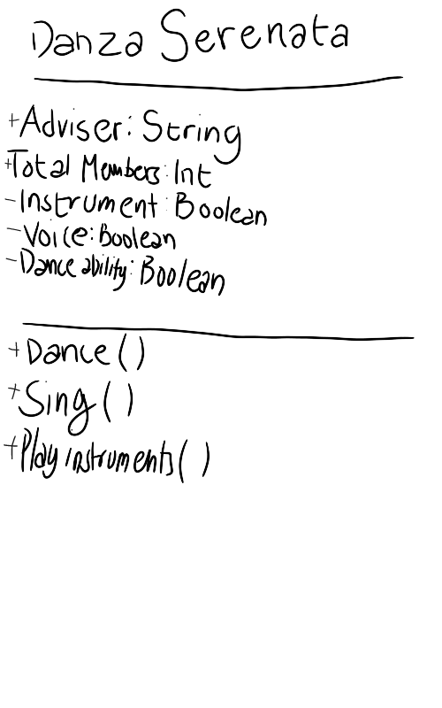
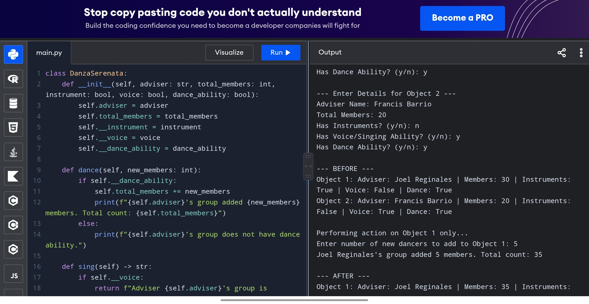

# Class Attributes and Methods
## Previous Design
Link to my previous activity:
[classObjectUML.md](classObjectUML.md)
## Design Revision
## No major changes were needed from my originsl design.
## Visibility Decisions
| Attribute | Data Type | Visibility | Reason |
|---|---|---|---|
| Adviser|String |Public|I chose the adviser to be public because it is public information that almost any class needs to view directly. |
| Total members | Int |Public | I chose the total members to be public because it is a general summary intended for everyone to view. |
|Instruments|Boolean|Private|I chose the instruments to be private because it is a skill evaluation that is protected and should not be shared with others. |
|Voice Range|Boolean|Private|I chose the instruments to be private because it is a skill evaluation that is protected and should not be shared with others. |
|Dance Ability|Boolean|Private|I chose the instruments to be private because it is a skill evaluation that is protected and should not be shared with others. |
## Updated UML Class Diagram

## Python Implementation [View Python Source](classImplementation.py)
## Test Run

## Object Diagram

## Analysis
### Why did you make your chosen attribute private?
### Which method changes the state of your object?
### How did your two objects demonstrate that instances are independent?
### What is the difference between your class diagram and your object diagram?
