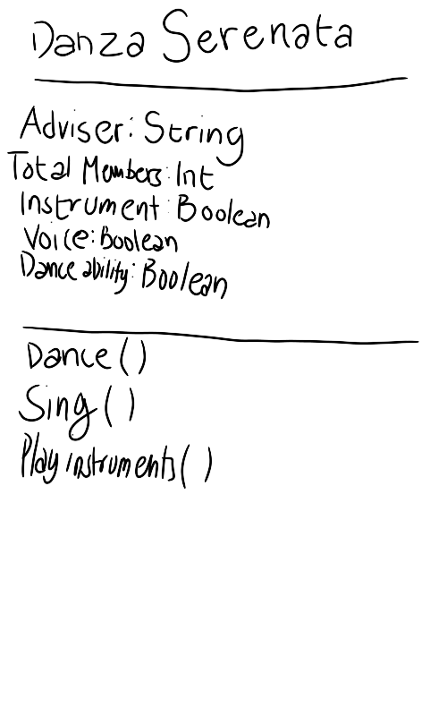

# SG4 - Understanding Classes and Objects
## Danza Serenata
## Organization of three disciplines (Dance Troupe, Harmonia, Rondalla) 
## Properties
|---|---|---|
| Property | Data Type | Description |
|Adviser|string|Teacher in charge|
|Total members|int|amount of students|
| Instruments|boolean|can play instruments well or not|
| Voice range| boolean| can sing well or not|
| Dance ability| boolean| can dance well or not|
## Methods
| Method | Description |
|---|---|
|Dance|Moves body to express emotions| 
|Sing|Use voice to create sound|
|Play|Creates music using instruments|
## Class Diagram

## Design Explanation
### Why did you choose this class?
I had difficulties thinking of a class, this was the first thing that came to mind. 
### Which property is the most important? Why?
Advisor because the other properties have equal importance. I chose this property also because an adviser is someone who guides the club, without them, the club won't stand by itself. 
### Which method is the most useful? Why?
Dance because I personally have biases on the three. Overall, they are equal but from my preferences, I think that dance is more useful. 
