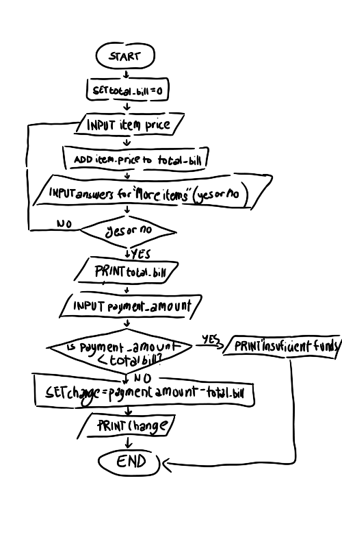

Main Problem:
During lunch break, students take too long to order, the cashier manually computes and give change, and has no way to track the amount of food left. This makes the school canteen queue very slow.

Sub-Problems:
-The students spend too much time deciding what to order.

-The cashier takes too long to calculate the student's total bill and change manually.

gThere is no automated system for determining whether an item is out of stock.

Sub-Problem: The students spend too much time deciding what to order.

CT Skill: Abastraction

Example solution: A simple digital menu or a pre order app so that students could choose their food before entering the line. 

Sub-Problem: The cashier takes too long to calculate the student's total bill and change manually.

CT Skill: Algorithm 

Example Solution: A program that sums ip item prices and calculates exact change automatically.

Sub-Problem: There is no automated system for determining whether an item is out of stock.

CT Skill: Pattern Recognition

Example Solution: Analyze the sales statistics to determine the trends in the order of the students. It will help the canteen to forecast and make preparations for the shortage of supplies.

